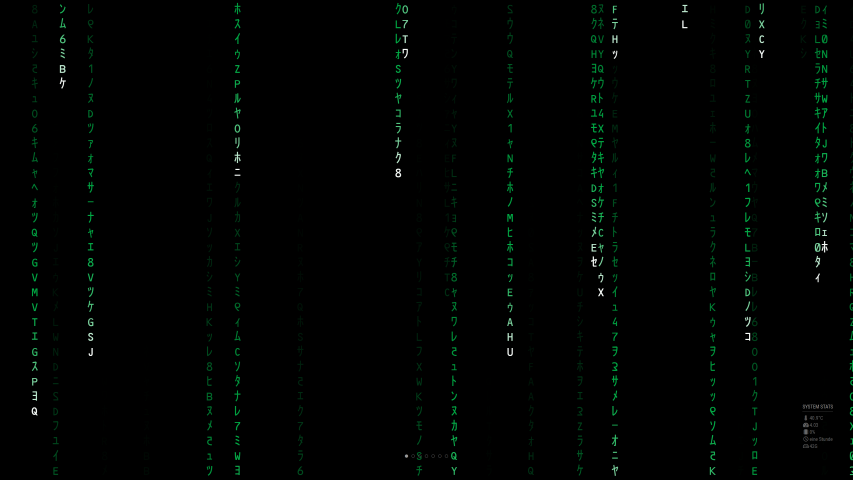

# MMM-FF-digital-rain

[](https://choosealicense.com/licenses/isc)

Wake up, $USER...

A module for [MagicMirror²](https://github.com/MichMich/MagicMirror) giving you the cyberpunk feeling in the morning that you deserve.

It is pretty **resource intensive**. You're warned. It's probably more a Raspberry Pi 5 thing. ;)

The Matrix has you...

## Installation

Navigate to the modules directory of your MagicMirror² installation and clone this repository.

Optionally download a more suitable font and place it in `~/MagicMirror/modules/MMM-FF-digital-rain/public/fonts`. Then set the `fontURL` property in your `config` file.

https://www.dafont.com/matrix-code-nfi.font

```sh
git clone https://github.com/shin10/MMM-FF-digital-rain.git

# (optional) download a font and place it in `~/MagicMirror/modules/MMM-FF-digital-rain/public/fonts`
$(
  cd MMM-FF-digital-rain/public/fonts &&
  wget -O  matrix-code.zip "https://dl.dafont.com/dl/?f=matrix_code_nfi" &&
  unzip matrix-code.zip
)
```

## Configuration

**Example:**

```js
...
modules: [
  {
      module: 'MMM-FF-digital-rain',
      position: 'fullscreen_below',
      config: {
        numberOfDrops: 15,
        numberOfMutations: 5,
        fontSize: '2em',
        fontURL: '/modules/MMM-FF-digital-rain/public/fonts/matrix%20code%20nfi.ttf',
        chars: 'abcdefghijklmnopqrstuvwxyzABCDEFGHIJKLMNOPQRSTUVWXYZ0123456789$+-*/=%"\'#&_(),.;:?!\|{}<>[]^~',
        color: '#0A4',
        distribution: function (x) { return (Math.random() < .5 ? -.5 : .5) * Math.pow(x, 2) + .5 },
      }
    },

]

```

## Config

| **Option**          | **Description**                                                                                                                               |
| ------------------- | --------------------------------------------------------------------------------------------------------------------------------------------- |
| `fps`               | The maximum number of frames per second.                                                                                                      |
| `numberOfDrops`     | The number of drops running down your screen.                                                                                                 |
| `numberOfMutations` | The number of mutations changing on screen characters randomly.                                                                               |
| `fontSize`          | Any valid CSS unit, like `16px`, `2em` etc.                                                                                                   |
| `fontURL`           | The path to your custom font, if you want to go that extra mile.                                                                              |
| `chars`             | The list of characters that should be picked randomly.                                                                                        |
| `color`             | Either a valid CSS color like a hex string `#0A4` or a function returnig it. The function will get the x coordinate as number between `0 - 1` |
| `distribution`      | A function to map the raindrops' x coordinate at birth. Takes a number between `0 - 1` and is expected to return a number from `0 - 1`        |

### Color function examples

**Rainbow:**

```js
function (x) { return '#f00' }
```

**Rainbow:**

```js
function (x) { return `hsl(${360 * x}deg 100% 50%)` }
```

**Random:**

```js
function (x) { return `#${(Math.random() * 0x1000000).toString(16).padStart(6, '0')}` }
```

**Vivid & Random:**

```js
function (x) { return `hsl(${360 * Math.random()}deg 100% 50%)` }
```

**Surprise the fickle:**

```js
function (val) {
  if (val === 0) {
    this.horizontalGradient = Math.random() < .4;
    let colorRangeMin = 0.2;
    let colorRangeMax = Math.random() < .3 ? 1 : .3;
    this.colorRange = colorRangeMin + Math.random() * (colorRangeMax - colorRangeMin);
    this.colorOffset = Math.random();
  }
  if (this.horizontalGradient) {
    return `hsl(${360 * (this.colorOffset + this.colorRange * val)}deg 100% 50%)`;
  } else {
    return '#0A4';
  }
},
```

### Distribution function examples

**Default (linear):**

```js
function (x) { return x }
```

**Mostly in the center**

```js
function (x) { return (Math.random() < .5 ? -.5 : .5) * Math.pow(x, 2) + .5 }
```

Follow the white rabbit. [&block;](https://www.youtube.com/watch?v=lL3i3gfiQiY)
